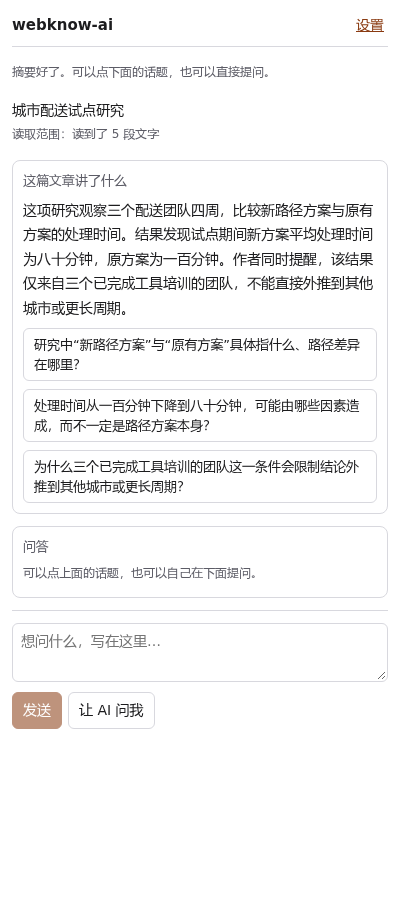
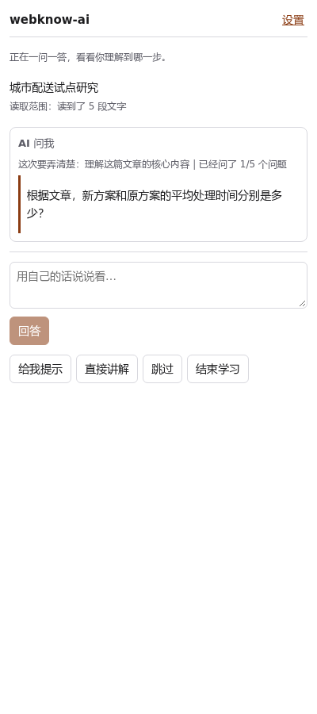
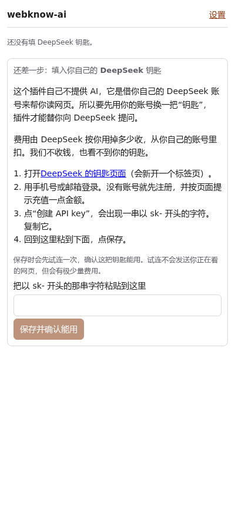

# webknow-ai

> 在公开网页旁边帮你读懂它的浏览器插件。面向普通读者，不需要任何技术背景。



你在浏览器里读一篇长文章时，它会在旁边开一个小栏：

- **先给你一段短摘要**：不用自己啃完全文，先知道这篇讲了什么；
- **给你几个可以点的话题**：点一下就是一段解释；
- **你可以随时自己提问**：它会区分"这是作者说的"和"这是它补充的知识"；
- **想检验自己看懂没有，可以让它反过来问你**：一次只问一个问题。



它**不会**在你点"开始"之前偷看页面，也**不会**在你换了页面之后把上一页的内容拿来充数。

---

## 一、装之前，你需要一把"DeepSeek 钥匙"

这是唯一一件稍微麻烦的事，请耐心看完。

**为什么要钥匙？** 这个插件自己不提供 AI，它是借用 DeepSeek（一家做 AI 的公司）的服务来帮你读文章。用别人的服务需要先有一把"钥匙"，就像进小区要刷卡。

**要花钱吗？** 要，但不多。费用由 DeepSeek 按你用掉多少收，从你自己的 DeepSeek 账号扣。**我们不收任何费用，也看不到你的钥匙。**

**怎么拿到钥匙？**

1. 打开 <https://platform.deepseek.com/api_keys>。
2. 用手机号或邮箱注册、登录。
3. 按页面提示充值一点金额（第一次可以先充最小额度试试）。
4. 找到 **API keys** 页面，点"创建 API key"。
5. 屏幕上会出现一串以 `sk-` 开头的字符，**复制它**（只显示一次，请立刻复制）。

> 这串字符等于你的钱包密码，**不要发给任何人**，也不要贴到聊天群里。

## 二、安装

> ⚠️ **不要点 GitHub 页面上那个绿色的 "Code → Download ZIP"。**
> 那是给开发者看的源码，Chrome 装不了——它会提示 **"清单文件缺失或不可读取"**。
> 能安装的包叫 `webknow-ai-<版本>-chrome.zip`，在
> **[Releases](https://github.com/wasteball/webknow-ai/releases/latest)** 页面里（或由我们直接发给你）。

### 正常方式（应用商店，尚未开放）

上架之后是这样：在浏览器的应用商店里搜索 webknow-ai → 点"添加" → 确认。**目前还没有上架**，所以请用下面的方式。

### 目前的方式（大约 3 分钟，需要手动操作）

> 下面几步是浏览器自己的界面，没法配图，所以我把每个按钮的名字都写出来了。
> 找不到哪一步，就把当前屏幕截图发给我们。

**第 0 步：拿到安装包并解压**

1. 在电脑上新建一个文件夹，名字用英文，比如 `D:\webknow-ai`（**别放桌面**，也别用中文路径）。
2. 把 `webknow-ai-<版本>-chrome.zip` 放进去，右键 → **全部解压缩**。
3. 解压后，**这个文件夹里应该直接看得到 `manifest.json`**，还有一个 `icon` 文件夹；
   如果里面还套着一层同名文件夹，那说明多套了一层，待会儿要选里面那一层。

> 怎么确认自己拿到的不是源码：源码包里会有 `package.json`、`src` 文件夹，**没有** `manifest.json`。
>
> **这个文件夹以后不能删、不能改名、不能挪位置。** 删了或挪了，插件就会失效。

**第 1 步：打开浏览器的扩展管理页面**

在浏览器地址栏输入下面这行，回车：

```
chrome://extensions
```

（Edge 浏览器是 `edge://extensions`）

**第 2 步：打开"开发者模式"**

页面**右上角**有一个叫 **开发者模式** 的开关，把它打开。

**第 3 步：加载插件**

点左上角的 **加载已解压的扩展程序**，选中第 0 步解压出来的那个文件夹，确定。

**第 4 步：确认装好了**

页面上会多出一张卡片，写着 **webknow-ai**，图标是棕色方块里一个白色对话气泡。

**第 5 步：固定到工具栏**

1. 看浏览器**右上角**、地址栏右边那排小图标，找到一个像**拼图**的图标，点它。
2. 在列表里找到 **webknow-ai**，点它右边的**图钉**图标。

装好了。以后要用，就点工具栏上那个棕色气泡图标。

### 安装常见问题

| 情况 | 原因和处理 |
|---|---|
| 工具栏上找不到图标 | 点右上角的拼图图标，在里面找 webknow-ai，点图钉固定。 |
| 卡片上写着"扩展程序已损坏"或变灰 | 存放插件的文件夹被删掉或挪走了。放回原位置，或重新解压一次。 |
| 点"加载已解压的扩展程序"没反应 | 确认选中的是**文件夹**本身（里面能看到 `manifest.json`），不是压缩包。 |
| 想更新版本 | 解压新版本覆盖原文件夹，然后到 `chrome://extensions` 点卡片上的**刷新**按钮。 |
| 想卸载 | 到 `chrome://extensions` 点卡片上的**移除**。钥匙和设置会一起删掉。 |

> 需要 Chrome 114 或更高版本（侧栏功能的要求）。

## 三、第一次使用

1. 打开一篇你想读的文章（公开发布的文章页面，比如新闻、科普、教程）。
2. **点工具栏上的 webknow-ai 图标**，右边滑出小栏。
3. 它先请你填钥匙：



把复制的 `sk-` 开头那串字符粘进去，点"保存并确认能用"。这一步会连一次 DeepSeek 确认钥匙没问题，**不会发送你正在看的网页**，但会有极少量费用。

4. 它会先让你确认：**这一页的文字会发给 DeepSeek**，费用从你的账号扣。请只在你确认这一页是公开的、你有权这样用的时候，点 **"我确认，开始伴读"**。
5. 浏览器会紧接着问你是否允许读取这个网站，选 **允许**（只针对这一个网站）。
6. 等几秒，摘要和话题就出来了。

## 四、怎么用

- **想看话题**：点摘要下面那些浅色的话题卡片。
- **想自己问**：在最下面的输入框里写问题，点"发送"。
- **想知道自己看懂没有**：点"让 AI 问我"。它会一次问你一个问题。
  - 答不上来有四个按钮随时可用：**给我提示**、**直接讲解**、**跳过**、**结束学习**。
  - 它最多问 5 个问题，问完给你一个小结：哪些是你自己答出来的、哪些是看了提示才答出来的、哪些还没弄清楚。**它不会说你"已经学会了"。**
- **它说错了**：直接反驳它。它发现你说得有理，会承认并修正。
- **不想等了**：点"停止"，立刻停下。

## 五、你看到的每句话，来源都说清楚了

| 标签 | 意思 |
|---|---|
| 原文里说的 | 作者在文章里明确写了 |
| 补充说明 | 解释概念的背景知识 |
| 打个比方 | 为了让你理解临时编的例子，不是文章内容 |
| 文章之外的知识 | 来自 AI 的知识，不是这篇文章写的 |
| 没法确认 | 它不确定，没有把握 |

看到"原文里说的"，下面还有"看看原文"的链接，点了会跳到文章对应段落。**如果那段已经找不到了，它会直说找不到，不会假装跳过去了。**

页面顶部还会写清楚**读了哪部分**（比如"读到了 12 段文字；2 张图片没读"）。图片里的内容它读不了，所以不会假装知道。

## 六、你的内容会去哪

- **网页内容、摘要、对话、学习记录**：只在你这次开着浏览器的时候保留。关掉标签页清掉那一页，关掉浏览器全部清掉。
- **钥匙和设置**：存在你自己的浏览器里，不跟着浏览器账号同步到别的电脑。
- **发给 DeepSeek 的是**：这一页的正文、你的问题、前几轮对话。**不经过我们**——我们没有服务器，看不到你的内容。
- **想立刻清掉**：点右上角"设置"，里面有"清掉这一页的内容"和"清掉所有页面的内容"。

## 七、遇到问题

| 情况 | 怎么办 |
|---|---|
| 提示钥匙不对 | 到设置里换一把。确认复制时没有多出空格。 |
| 提示余额不够 | 去 DeepSeek 官网充值，回来重试。对话记录都还在。 |
| 提示太忙 | 等一两分钟再试。它不会背着你反复重试。 |
| 提示这一页读不了 | 目前只支持公开发布的文章类网页。登录后才能看的、要付费的、视频页、搜索结果页都不行。 |
| 换了页面以后不动了 | 这是故意的：换了页面必须重新点"开始伴读"。 |
| 点过"给我提示"，小结没算我自己答的 | 也是故意的：用了提示就不能算独立答出来。 |

---

## 给开发者

构建、测试、架构、权限边界和已知限制都在 [DEVELOPING.md](DEVELOPING.md)。

本项目处于早期阶段（路线图 A0），**尚未上架，也未完成真实读者试点**。源码采用 MIT 许可。
