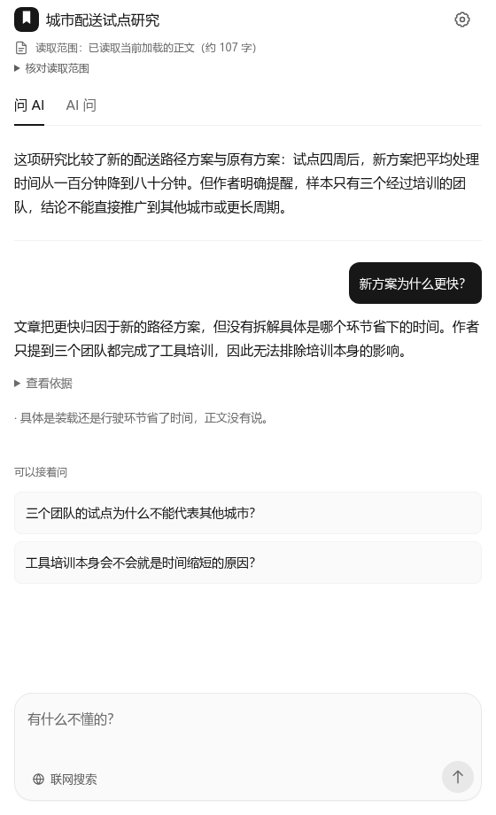
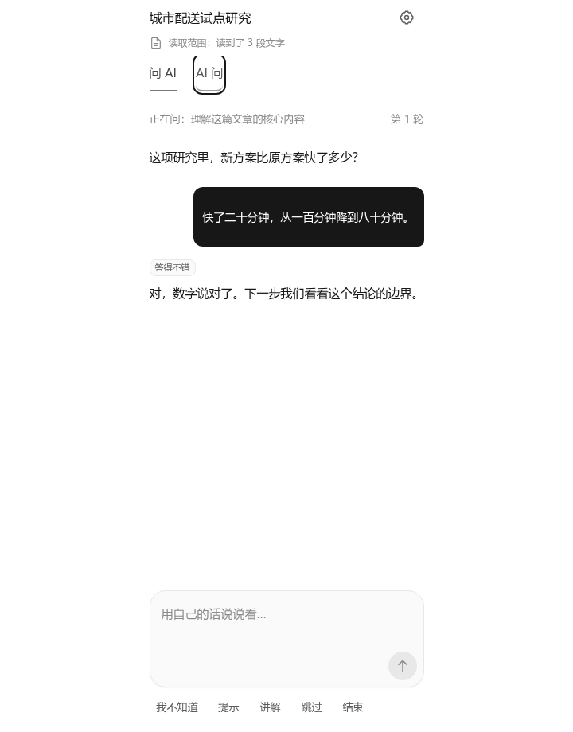
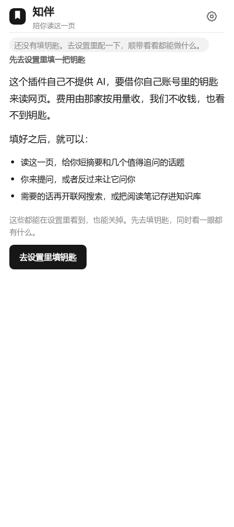

# 知伴（webknow-ai）

> 在当前网页旁，帮你看懂文章、发现值得深入的问题，并通过双向对话检验理解的 AI 阅读伙伴。

知伴是一款 Chrome 浏览器侧栏扩展，面向阅读公开文章的普通读者。适用范围是**公开、可提取连续正文、且你有权发送给模型的 HTML 页面**。它需要你自备 DeepSeek 或智谱的 API Key；每篇文章都由你点按钮开始阅读。



你在浏览器里读一篇文章时，点工具栏里的知伴图标打开侧栏，再选择「总结摘要」「出几个问题」或「让它问我」开始；首次外发时，按钮前会加「我确认，」：

- **先给你一段短摘要**：不用自己啃完全文，先知道这篇讲了什么；
- **给你几个可以点的话题**：点一下就是一段解释；
- **你可以随时自己提问**：默认依据这篇文章回答，没写清楚的地方会说明；你明确要求拓展或启用联网搜索时，补充内容会单独标明来源；
- **想检验自己看懂没有，可以让它反过来问你**：一次只问一个问题。



以上两张界面图使用模拟文章和对话展示布局，不代表模型回答质量。

点开始前，知伴不会提取或发送正文；换页后也不会自动读取新文章。模型生成的内容可能有误，请用「看看原文」核对。

---

## 一、装之前，你需要一把"钥匙"

这是唯一一件稍微麻烦的事，请耐心看完。

**为什么要钥匙？** 这个插件自己不提供 AI，它是借用 AI 公司的服务来帮你读文章。用别人的服务需要先有一把"钥匙"，就像进小区要刷卡。

**用哪家？** 目前可以选 **DeepSeek** 或**智谱**，两家都支持摘要、提问与理解检验。内容图片转述只在使用 DeepSeek 时尝试；使用智谱或图片读取失败时，知伴会标明未读范围。你选哪家，正文就发给哪家；换一家，插件会再问你确认一次。默认选 DeepSeek，可在「设置 → 模型」切换。

**要花钱吗？** 模型调用可能产生费用，由你选的供应商按其规则向你的账号收取，具体费用以其账单为准。知伴开发者不提供模型额度，也不经手你的 Key 或正文。

**怎么拿到钥匙？** 去你选的那家的开放平台注册、充值、创建 API key：

- DeepSeek：<https://platform.deepseek.com/api_keys>
- 智谱：<https://open.bigmodel.cn/usercenter/apikeys>

按所选平台的指引注册账号、处理额度和费用，再创建并复制 API Key。**插件设置页也有对应的官方链接**，不用记。

> 这串字符等于你的钱包密码，**不要发给任何人**，也不要贴到聊天群里。

## 二、安装

> ⚠️ **不要点 GitHub 页面上那个绿色的 "Code → Download ZIP"。**
> 那是给开发者看的源码，Chrome 装不了——它会提示 **"清单文件缺失或不可读取"**。
> 能安装的包叫 `webknow-ai-<版本>-chrome.zip`，在
> **[Releases](https://github.com/wasteball/webknow-ai/releases/latest)** 页面里（或由我们直接发给你）。

### 应用商店（尚未开放）

知伴目前尚未上架浏览器应用商店，请按下面的步骤安装 Release 包。

### 目前的方式（大约 3 分钟，需要手动操作）

> 下面几步是浏览器自己的界面，没法配图，所以我把每个按钮的名字都写出来了。
> 找不到哪一步，就把当前屏幕截图发给我们。

**第 0 步：拿到安装包并解压**

1. 在电脑上新建一个准备长期保留的文件夹，例如 `D:\webknow-ai`。
2. 把 `webknow-ai-<版本>-chrome.zip` 放进去，右键 → **全部解压缩**。
3. 解压后，**这个文件夹里应该直接看得到 `manifest.json`**，还有一个 `icon` 文件夹；
   如果里面还套着一层同名文件夹，那说明多套了一层，待会儿要选里面那一层。

> 怎么确认自己拿到的不是源码：源码包里会有 `package.json`、`src` 文件夹，**没有** `manifest.json`。
>
> **这个文件夹以后不能删、不能改名、不能挪位置。** 删了或挪了，插件就会失效。

**第 1 步：打开浏览器的扩展管理页面**

在浏览器地址栏输入下面这行，回车：

```
chrome://extensions
```

（Edge 浏览器是 `edge://extensions`）

**第 2 步：打开"开发者模式"**

页面**右上角**有一个叫 **开发者模式** 的开关，把它打开。

**第 3 步：加载插件**

点左上角的 **加载已解压的扩展程序**，选中第 0 步解压出来的那个文件夹，确定。

**第 4 步：确认装好了**

页面上会多出一张写着 **知伴** 的卡片，图标是朱红底色上的白色书签。

**第 5 步：固定到工具栏**

1. 看浏览器**右上角**、地址栏右边那排小图标，找到一个像**拼图**的图标，点它。
2. 在列表里找到 **知伴**，点它右边的**图钉**图标。

装好了。以后要用，就点工具栏上的朱红书签图标。

### 安装常见问题

| 情况 | 原因和处理 |
|---|---|
| 工具栏上找不到图标 | 点右上角的拼图图标，在里面找知伴，点图钉固定。 |
| 卡片上写着"扩展程序已损坏"或变灰 | 存放插件的文件夹被删掉或挪走了。放回原位置，或重新解压一次。 |
| 点"加载已解压的扩展程序"没反应 | 确认选中的是**文件夹**本身（里面能看到 `manifest.json`），不是压缩包。 |
| 想更新版本 | 解压新版本覆盖原文件夹，然后到 `chrome://extensions` 点卡片上的**刷新**按钮。 |
| 想卸载 | 到 `chrome://extensions` 点卡片上的**移除**。钥匙和设置会一起删掉。 |

> 需要 Chrome 114 或更高版本（侧栏功能的要求）。

## 三、第一次使用

1. 打开一篇你想读的文章（公开发布的文章页面，比如新闻、科普、教程）。
2. **点工具栏上的知伴图标**，右边滑出侧栏。
3. 还没有 Key 时，侧栏会请你点 **「去设置里填钥匙」**，在新开的设置页里配置模型：



在设置 → 模型里粘上那串字符，点「保存」。这一步会向你选的供应商做一次最小连接测试，**不会发送你正在看的网页**，但可能产生少量费用。（DeepSeek 的 Key 以 `sk-` 开头，智谱的不是，页面上会写清楚。）

4. 回到文章侧栏，阅读外发说明：**正文会发送给你选的模型供应商；使用 DeepSeek 时还会尝试发送可读取的内容图片**，费用从你的账号扣。只在页面公开且你有权外发时，点 **「我确认，总结摘要」**；也可选「我确认，出几个问题」或「我确认，让它问我」。点按钮后才会读取与发送。
5. 换了一页，侧栏还开着。再次点 **总结摘要**、**出几个问题** 或 **让它问我**，才会读新的一页。若工具栏的当前页临时授权已失效，侧栏按钮可能请求**读取所有 HTTP(S) 网页**的可选权限；授权后仍只在你点阅读入口时读取正文。若只想授权当前页，在这页再点一次知伴工具栏图标，然后点侧栏阅读入口。
6. 等几秒，摘要和话题就出来了。

## 四、怎么用

- **调宽窄**：把鼠标移到侧栏和网页之间的分隔线上，按住往两边拖，就能调宽调窄；你调到的宽度浏览器会自己记住，下次打开还是这个宽度。
- **切换两件事**：侧栏顶部有两个模式——**问 AI**（摘要、话题、自己提问）和 **AI 问**（它反过来考你）。随时能切，进度和你没发出去的问题都不会因为切走而丢。
- **改设置**：还没开始读或换页时，「设置」齿轮与「读这一页／换了一页」同排；伴读中它在文章标题右侧。点它会**新开一个整页的设置标签页**，分类为阅读、模型、提示词、联网搜索、知识库、清除和关于。改完回到侧栏继续阅读。
- **想看话题**：点摘要下面那一排卡片，点一张就发出去，整排都收起。答完后，新的联想问题出现在这条回答下面，接着点、接着问。
- **想自己问**：在最下面的输入框里写问题，点框内右下角的上箭头发送；Enter 发送，Shift + Enter 换行，输入区随文字自动增高。也可以在网页上划一段话，点「问这句」——引用会放在输入框内部上方，再写问题，回答就会针对这段原文；点引用右侧的 × 可移除它。遇到「这次生成的内容没法用」时，本轮不会写入对话；你可以继续提问。回答中的 Mermaid 图表会以彩色画出来；点图或放大镜图标会先让整张图适配侧栏，再用图标缩放、复位，或拖动查看细节。点侧栏里的全屏图标会打开一个独立的最大化弹窗；关掉弹窗会回到侧栏刚才的缩放和位置。在弹窗里还可以用全屏图标进入浏览器全屏，继续缩放、拖动和复位。在设置里关闭图表后显示源码。
- **想知道自己看懂没有**：切到 **AI 问**，再点一张卡片。它会围着这个点问你——可能是几道选择题，也可能是让你用自己的话回答（可以在设置里固定成其中一种）。点过的卡片不会再出现。
  - 开放问题答不上来有四个按钮随时可用：**给我提示**、**直接讲解**、**跳过**、**结束学习**；选择题轮把选项勾好点**提交答案**，也可以**直接讲解**或**跳过这一轮**。
  - 选择题提交后它会给你逐题判定和整轮分析，并根据错在哪里组织后续问题。
  - 它每次等你回答再继续；你可以随时结束并查看本轮小结，区分独立答出、经过提示和还没弄清楚的部分。它不会据此宣称你「已经学会了」。
- **想让回答带上网上的资料**：点输入框内左下角的「联网搜索」。未配置时会打开搜索设置，先启用一个服务；配置好后，这个按钮就是联网开关，带勾表示已打开。前三个（Firecrawl、Bing、DuckDuckGo）**不用注册、不用填 Key**，选中授权就能用；想更稳的话也可以用你自己的 SearXNG / Tavily / 博查。它只把你的**搜索词**发给搜索服务，文章正文不会发给它；用了网络资料时，回答会标明"根据网络资料"并附上链接。
  - 搜索服务和你的 AI 账号是分开的两件事——换任何模型都不影响它。
  - 三个免费服务各有脾气，一个不行就换一个：**Firecrawl** 是结构化接口、最省事；**Bing / DuckDuckGo** 是直接读对方的搜索结果页，**对方改版时可能失效**。真失效了，回答会照实说"这次只依据文章本身"，不会拿别的东西充数。
- **想查看 ima 里的内容**：到「设置 → 知识库」，点「打开 ima，扫码查看知识库」。在 ima 官网用微信扫码登录后，可查看个人、共享和订阅知识库。网页扫码只登录 ima 官网；若要让本扩展调用 ima 开放接口，还需在官网生成 Client ID 和 API Key，再回设置页连接。侧栏「存入知识库」入口仍在联调，当前版本不要依赖它保存阅读成果。
- **它说错了**：直接反驳它。它发现你说得有理，会承认并修正。
- **不想等了**：点输入框里的停止，立刻停下。

## 五、回答和提问围绕原文

默认摘要、回答、后续话题和“AI 问”都围绕当前读到的文章，可以换成容易懂的话来解释。提示词要求 AI 沿用原文的名称、条件和例子，原文没有说明时就指出缺口，避免自行补术语、案例或因果关系。选择题的错误选项也围绕文中已有的说法设计。

只有你在本次提问中明确要求文章之外的背景或例子，或开启联网并取得相关资料时，问答才会补充外部内容，并标明来源。流程、层级和交互关系适合时可以配 Mermaid 图；图里的节点和连线同样需要依据，短回答和简单对比优先用文字或表格。模型仍可能答错，“看看原文”可以帮助核对。

| 标签 | 意思 |
|---|---|
| 原文里说的 | 作者在文章里明确写了 |
| 补充说明 | 解释概念的背景知识 |
| 打个比方 | 为了让你理解临时编的例子，不是文章内容 |
| 文章之外的知识 | 来自 AI 的知识，不是这篇文章写的 |
| 没法确认 | 它不确定，没有把握 |

看到「原文里说的」，下面还有「看看原文」链接，点了会尝试定位并高亮文章中的对应段落。**如果那段已经找不到或无法唯一定位，它会说明失败，不会假装跳过去了。**

页面顶部会写清楚**读了哪部分**。使用 DeepSeek 时，知伴会尝试用视觉模型转述文章中的内容图片，一页最多处理 6 张；转述会标明「可能有误」，不能当作作者原文。使用智谱、图片获取失败或图片超出上限时，未读范围会明示。它不保证读懂以图片为主的页面。

## 六、你的内容会去哪

- **网页内容、摘要、对话、学习记录**：只在你这次开着浏览器的时候保留。关掉标签页清掉那一页，关掉浏览器全部清掉。
- **钥匙和设置**：存在你自己的浏览器里，不跟着浏览器账号同步到别的电脑。
- **发给你选的模型供应商的是**：这一页的正文、你的问题和前几轮对话。使用 DeepSeek 时，还会尝试发送可读取的内容图片供视觉模型转述。请求不经过知伴的代理服务器。换供应商就等于换接收方，所以插件会再问你确认一次。
- **联网搜索开启时**：你的**搜索词**会发给你在设置里选的那个搜索服务（不是 AI 公司，也不是我们），文章正文不会发给它。搜索服务怎么保存数据由它自己的规则决定。**免费的三个里，Firecrawl 是正规接口，Bing / DuckDuckGo 是直接读对方的搜索结果页**——后一条路径属于灰色地带，对方随时可能改版或限流。
- **知识库**：扫码登录发生在 ima 官网，本扩展不会读取官网的登录状态。扩展内的开放接口凭证只存于本地；当前侧栏尚未开放保存入口，不会自动把文章发给 ima。
- **想立刻清掉**：点右上角「设置」（会新开一个标签页），在「清除」分类里可以清掉这一页或所有页面的会话内容。

## 七、遇到问题

| 情况 | 怎么办 |
|---|---|
| 提示钥匙不对 | 到设置里换一把。确认复制时没有多出空格。 |
| 提示余额不够 | 去你选的那家的官网充值，回来重试。对话记录都还在。 |
| 提示太忙 | 等一两分钟再试。它不会背着你反复重试。 |
| 提示这一页读不了 | 目前只支持公开发布的文章类网页。登录后才能看的、要付费的、视频页、搜索结果页都不行。 |
| 换了页面以后还是上一页 | 上一页的结果已经放下。点「总结摘要」才读现在这一页。可在浏览器的权限提示中授权 HTTP(S) 网页，也可再点工具栏图标取得当前页临时授权后，回侧栏点阅读入口。 |
| 点过"给我提示"，小结没算我自己答的 | 也是故意的：用了提示就不能算独立答出来。 |

---

## 给开发者

构建、测试、架构、权限边界和已知限制都在 [DEVELOPING.md](DEVELOPING.md)。

本项目处于早期阶段（路线图 A0），**尚未上架，也未完成真实读者试点**。源码采用 MIT 许可。
